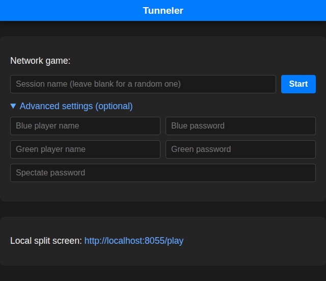
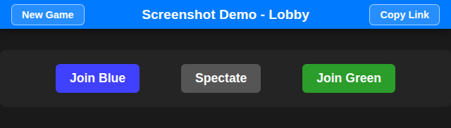
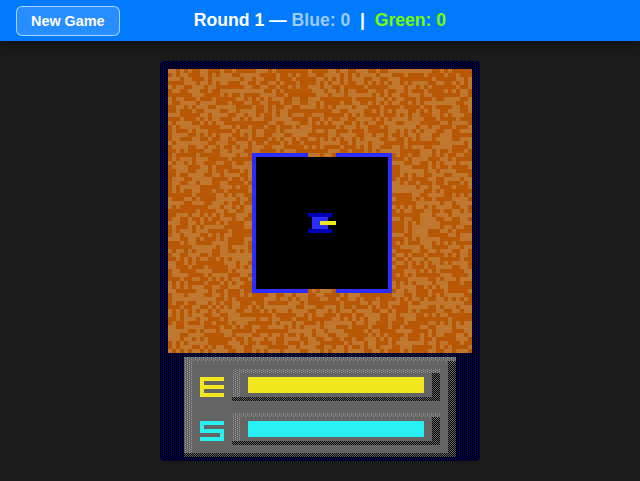
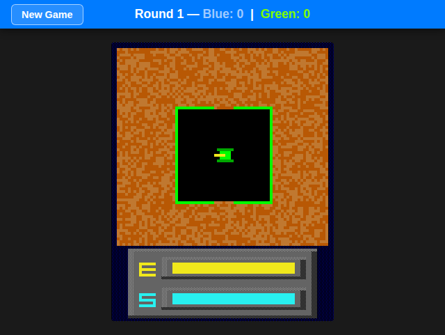
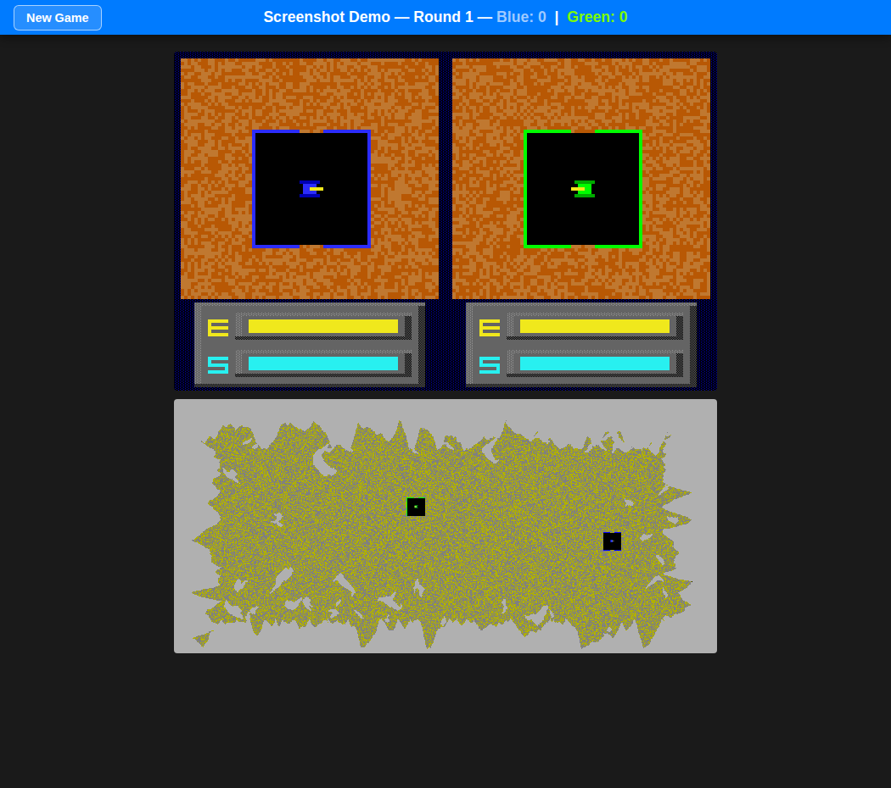
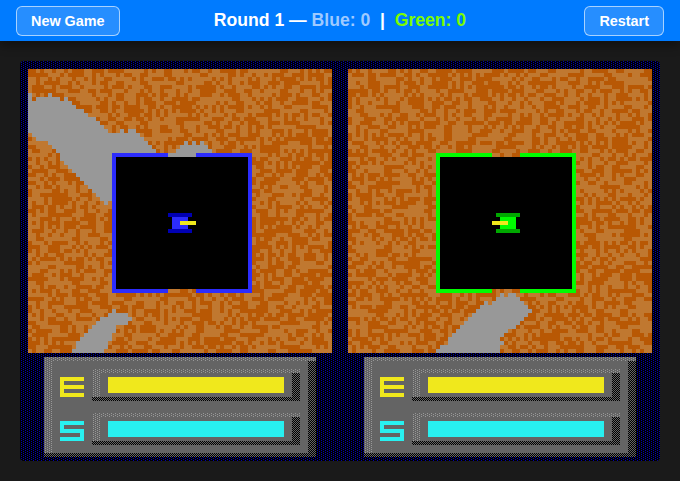

# Tunneler

**Landing page** — name a session to create/join it, or jump straight into local split screen:



**Lobby** — a session's own page, listing its Blue/Green/Spectate join buttons:



**Blue view** / **Green view** — each player only ever sees their own half of the split screen:




**Spectator view** — both halves, plus a live map overview and scoreboard:



**Local split screen** (`/play`) — one browser, hotseat, both tanks at once:



Tunneler by Geoffrey Silverton is a DOS game from 1991 written in Turbo Pascal. With Cicoparser it was converted into C++ and then rebuild with emscripten so it could be played inside browser. This is a proof of concept of turning cicoparser games into network multiplayer game.
You can play it here [http://cloud.valky.eu:8042/](http://cloud.valky.eu:8042/), or run it locally (see
"Running"/"Docker" below). This copy fetches the WASM/EXE binaries over HTTP, so it needs that server
running — it can't be opened as a bare local file anymore. A self-contained standalone build (no server
required) is available at [tunneler.html](https://rawgit.valky.eu/gabonator/Projects/refs/heads/master/CicoJit/gamelib/tunneler/netplay/tunneler.html)

The spectator view (`src/spectator.html`) shows both players, a live map overview, and a realtime scoreboard.

## Running

```bash
npm install       # installs runtime deps (express, ws, selfsigned) + esbuild (build-only, devDependency)
npm run build     # builds src/ -> public/ once - required before starting the server, it won't build this itself
node server.js    # serves the game over http AND https at once
```

Then open `http://localhost:8042/`, name a session, and share the Blue/Green/Spectate links it gives you
(`http://localhost:8042/play` for local same-browser split screen, no session needed). The https listener
(`https://localhost:8043/` by default) uses a self-signed certificate generated on first run into `certs/`
— your browser will warn about it being untrusted; that's expected, click through it. Put a real reverse
proxy (nginx/Caddy) in front of the http port instead if you need a publicly trusted certificate.

Options (`node server.js --help` prints these too):

| Flag | Env var | Default | Meaning |
|------|---------|---------|---------|
| `--port=N` / `--port N` / `-p=N` / `-p N` | `PORT` | `8042` | HTTP port |
| `--https-port=N` / `--https-port N` / `-P=N` / `-P N` | `HTTPS_PORT` | http port + 1 | HTTPS port |
| `--help` / `-h` | — | — | print usage and exit |

CLI flags win over env vars when both are given.

## Building / development

`build.js` turns `src/` (the actual source) into `public/` (what `server.js` serves statically) — it
minifies `.js`/`.css` with esbuild and copies everything else (html, images, the wasm binary, TUNNELER.EXE)
through unchanged. `public/` is entirely generated: never hand-edit it, the next build wipes it.

```bash
npm run build   # one-off build
npm run watch   # the whole dev loop in one command:
                #  - rebuilds public/ whenever a file under src/ changes
                #  - also runs server.js under Node's own --watch, restarting it on server.js changes
```

## Docker

```bash
docker build -t tunneler .
docker run -d -p 8042:8042 -p 8043:8043 tunneler
# or override the ports:
docker run -d -p 8042:8042 -p 8043:8043 -e PORT=8042 -e HTTPS_PORT=8043 tunneler
```

The image is a two-stage build: a `builder` stage installs full dependencies and runs `npm run build`,
then the final stage installs production-only dependencies and copies in just `server.js` and the built
`public/` — `src/`, `build.js`, and `esbuild` never ship in the final image. It runs as the image's
built-in non-root `node` user. The container's `certs/` self-signed cert isn't persisted across recreation
unless you mount `/app/certs` as a volume.

File list:
- game (source for all browser-served assets - see "Building / development" above for how this reaches the browser)
  - **index.html** / **index.js** / **index.css** - landing page: name a session to create/join it, or play local split screen
  - **tunneler.html** / **tunneler.js** / **tunneler.css** - main game (player view: blue/green/local split screen)
  - **spectator.html** / **spectator.js** / **spectator.css** - read-only view: both players, map overview, scoreboard
  - **lobby.html** / **lobby.js** / **lobby.css** - a session's landing page listing its Blue / Green / Spectate links
  - **netcode.js** - shared `Path`/`Game`/`Net` classes (WASM stepping, wire protocol, frame timing)
  - **assets/tunneler.wasm** - the compiled game engine, fetched at runtime
  - **assets/TUNNELER.EXE** - the original DOS executable's data, fetched at runtime and read by the WASM engine via the `apiRead` import
  - **wasmapp.js** - webassembly loader
- multiplayer support
  - **server.js** - web server for hosting the game and websocket multiplayer server (serves `public/` statically)
- build
  - **build.js** - minifies `src/` into `public/` (esbuild for .js/.css, straight copy for everything else) - see "Building / development" above; `server.js` does not run this itself
- deployment
  - **Dockerfile**
  - **package.json**
- this readme
  - **readme.md**
  - **index.png** / **lobby.png** / **blue.png** / **green.png** / **spectate.png** / **split-screen.png**